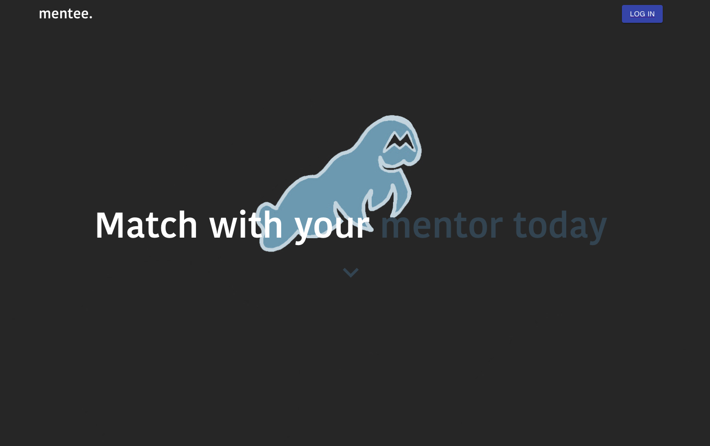

<!-- Improved compatibility of back to top link: See: https://github.com/othneildrew/Best-README-Template/pull/73 -->

<!-- PROJECT LOGO -->
 

     
  </img>

<h3 align="center">mentee.</h3>

  

    Mentee builds a diverse community where non-traditional learners receive mentorship from tech professionals through communication and collaboration to build a more diverse industry by shortening the margin of non-traditional backgrounds. 
     
     
    <a href="https://github.com/github_username/repo_name">View Demo</a>
   
  

## About The Project

Mentee is an application for high-school graduates or GED holders from underprivileged communities and nontraditional backgrounds looking to build career skills through mentorship and community. Mentees can practice technical code, learn what a career in tech looks like, and receive support from mentors and Mentee friends via live communication throughout their career journey. 

According to the National Center for Education Statistics, only about 38% of immigrants or first-generation Americans pursue higher education, with 30% of the initial graduating compared to 42% enrollment of their white counterparts (NCES). 

Within the industry, 97% of professionals hold an associate's Degree or higher, meaning only 3% of professionals within tech come from nontraditional backgrounds. White professionals also take up a large chunk of the industry, with 58.9% of tech professionals identifying as “white” (ZIPPIA). 

Statistics clearly illustrate the disadvantage a minority person from a nontraditional background faces trying to break into the tech industry. For BIPOC, receiving a boot camp of self-taught education is not sufficient. Individuals miss out on networking opportunities and job fairs that a higher education institution provides when they are not degreed. These opportunities compound over the four-year college career leading to 55% of graduates receiving an offer before graduation for full-time positions (BLS), creating a gap in the ability to enter the tech workforce between degreed and non-degreed. 

Mentee is a live-communication application that enables Mentees to find a community of mentors and other mentees in a similar trajectory and filter to find users with the same goals. Users log on to the application and are instantly greeted with a table populated with other users, they can filter through to find Mentees or Mentors. Mentors can  teach and lead, and mentees can learn, collaborate, and create a network of their choosing. Users can also utilize the inhouse technologies to video-call, text, and even screenshare, for the ease of communication.

### Built With
* [![React][React.js]][React-url]

<!-- CONTACT -->
## Contact

Shadman Chowdhury(Product Owner) - https://github.com/shadmanc01 
Jose Mazhuvanchery(Scrum Master) - https://github.com/josemazhuvanchery1
Noel Fernandez(Scrum Master) - https://github.com/noelfernandez98

Project Link: [https://github.com/github_username/repo_name](https://github.com/github_username/repo_name)

(<a href="#readme-top">back to top</a>)

<!-- ACKNOWLEDGMENTS -->
## Acknowledgments

* 
* 
* 

(<a href="#readme-top">back to top</a>)

[React.js]: https://img.shields.io/badge/React-20232A?style=for-the-badge&logo=react&logoColor=61DAFB
[React-url]: https://reactjs.org/
